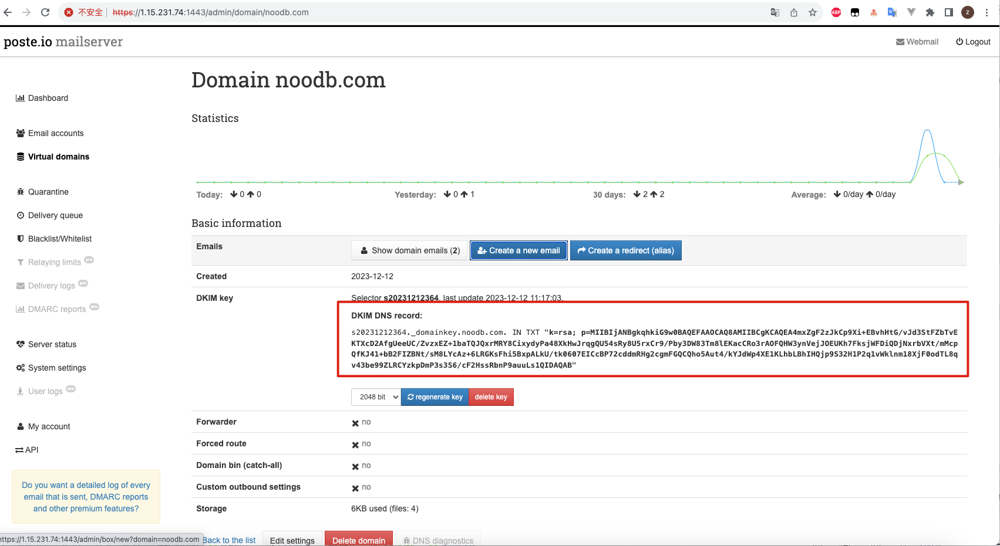
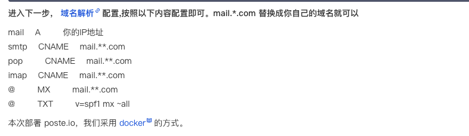

https://36.150.108.152:1443/admin/

skypr.net 
admin@skypr.net 
admin@1234 

## 账号

访问https://xxx:1433/ 会自动跳转到创建账号系统

1、必须要设置DKIM



2、 必须要开发docker下面的端口

3、 配置域名解析



## 
```yml

version: "3"
services:
  poste:
    image: analogic/poste.io
    volumes:
      - /etc/localtime:/etc/localtime:ro
      - ./data:/data
    container_name: poste
    hostname: mail.skypr.net
    ports:
      - "25:25"
      - "587:587"
      - "465:465"
      - "143:143"
      - "993:993"
      - "110:110"
      - "995:995"
      - "180:180"
      - "1443:1443"
    environment:
      - HTTP_PORT=180
      - HTTPS_PORT=1443
    restart: always

```

## 配置

180和1443 端口是 web端口

"25:25" 端口 是stmp
"143:143" 端口 是itmp

##  


